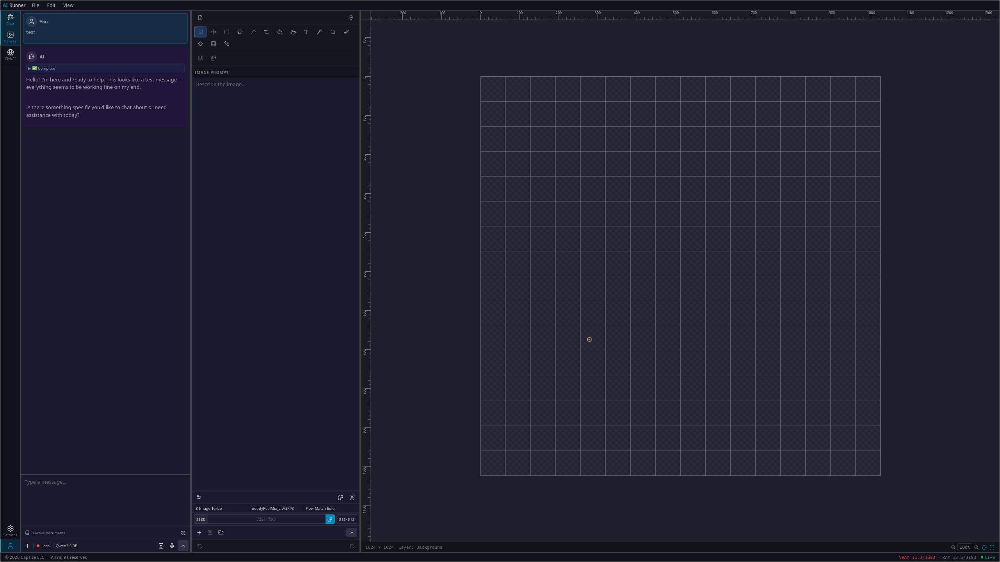

# AI Runner

> Edge AI inference engine with a web GUI — LLMs, image generation, voice chat, and agents running entirely on your hardware, at the edge.

[](LICENSE)
[](https://www.python.org/downloads/)
[](https://github.com/Capsize-Games/airunner/stargazers)

[🐞 Report Bug](https://github.com/Capsize-Games/airunner/issues/new?template=bug_report.md) · [✨ Request Feature](https://github.com/Capsize-Games/airunner/issues/new?template=feature_request.md) · [🛡️ Report Vulnerability](https://github.com/Capsize-Games/airunner/issues/new?template=vulnerability_report.md) · [📖 Wiki](https://github.com/Capsize-Games/airunner/wiki)



---

## What is AI Runner?

AI Runner is a privacy-first edge AI platform — all inference runs locally on your own hardware, not in the cloud. It runs a Python backend that handles model inference and exposes a REST API, paired with a React web frontend you access in your browser. Your prompts, images, and voice data never leave your machine.

**Architecture at a glance:**

```
client/src/             ← AIRunner framework frontend (React + Vite, port 5173)
server/                 ← AIRunner framework backend (Python / FastAPI, port 8080)
projects/uwuchat/       ← UwUchat — a cloud project built on the framework
extensions/             ← Optional feature extensions loaded at runtime
```

AI Runner is a **framework** for building AI-backed apps (edge or cloud). This
repo also contains UwUchat, the first project built on it — see
[CLAUDE.md](CLAUDE.md) for the framework/project split.

---

## ✨ Features

| Feature | Description |
|---|---|
| **🤖 LLM Chat** | Local LLMs via llama.cpp (GGUF), with optional OpenRouter/OpenAI backends |
| **🗣️ Voice Chat** | Real-time speech-to-text and text-to-speech for hands-free conversations |
| **🎨 Image Generation** | Stable Diffusion (SD 1.5, SDXL) and FLUX with LoRA and inpainting |
| **🧠 AI Agents** | Configurable personalities, hierarchical memory, pgvector RAG, and tool use |
| **🔒 Privacy First** | Runs fully offline by default — no data leaves your machine |
| **🛡️ Encrypted at Rest** | Sensitive agent memory and conversation data encrypted with AES-128 (Fernet) |
| **🌐 Web UI** | React frontend, accessible from any browser on your local network |
| **⚡ Optimized** | GGUF quantization, attention slicing, and VRAM offloading for lower-end hardware |

---

## ⚙️ System Requirements

| | Minimum | Recommended |
|---|---|---|
| **OS** | Ubuntu 22.04 | Ubuntu 24.04 |
| **CPU** | Ryzen 2700K / i7-8700K | Ryzen 5800X / i7-11700K |
| **RAM** | 16 GB | 32 GB |
| **GPU** | NVIDIA RTX 3060 | NVIDIA RTX 4080+ |
| **Storage** | 22 GB SSD | 100 GB+ SSD |
| **Python** | 3.13.3+ | 3.13.3+ |

---

## 🚀 Quick Start

### Docker (recommended)

Neither Node.js nor Python needs to be installed on your host — the dev
stack runs entirely in Docker (Postgres + the server, with the client
optionally added):

```bash
git clone https://github.com/Capsize-Games/airunner.git
cd airunner
./scripts/docker.sh up            # start the server (auto-detects GPU)
./scripts/docker.sh up --client   # also start the Vite dev server (:5173)
```

First run prompts for any missing credentials (e.g. an OpenRouter API key)
and saves them to the project's `.env` automatically.

Then open your browser at **http://localhost:5173**. The backend API is
available at **http://localhost:8080**.

See [docker/README.md](docker/README.md) for GPU passthrough, model
persistence, and extension setup.

### Bare-metal install (advanced)

You can also install the Python backend and frontend dependencies directly
on the host:

```bash
./scripts/install.sh
./scripts/run_web.sh
```

This is the same entry point Docker uses under the hood — see
[Manual Installation](#-manual-installation-advanced) below for the
individual steps.

### Logs

All server and runtime (art, TTS, STT, LLM) logs go through the server
container:

```bash
./scripts/docker.sh logs server
```

#### Production logs (uwuchat.com)

Use `scripts/prod-logs.sh` to view logs from the live server:

```bash
# Last 200 lines (default)
./scripts/prod-logs.sh

# Follow live output (Ctrl-C to stop)
./scripts/prod-logs.sh -f

# Last 500 lines
./scripts/prod-logs.sh -n 500

# Different container (e.g. fastsearch)
./scripts/prod-logs.sh -s fastsearch
```

Requires the SSH key referenced by `$AIRUNNER_PROD_SSH_KEY` to be present.

---

## 🌐 Edge vs. Cloud Deployment

AI Runner supports two deployment modes controlled by the `VITE_DEPLOYMENT`
environment variable:

| Value | Mode | Description |
|---|---|---|
| `edge` | Edge (default) | Full-featured local GPU device — TTS, STT, VRAM/RAM stats, model management |
| `cloud` | Cloud / SaaS | Stripped-down production mode — hides hardware stats, voice controls, and other local-only features |

### Setting the deployment type

**Build-time (Docker / production builds):**

```bash
# In projects/uwuchat/.env or docker-compose.yml
VITE_DEPLOYMENT=cloud
```

When `VITE_DEPLOYMENT=cloud`, the following UI elements are hidden:
- TTS (speaker) and STT (microphone) buttons in the chat toolbar
- VRAM / RAM resource monitor in the footer
- Edge-specific settings sections (sound, TTS, memory management)

### Runtime override (development)

When developing locally, you can switch modes without recompiling. The
deployment override is persisted to `localStorage` under the key
`airunner_deployment`.

**From the browser console:**
```js
// Switch to cloud mode
localStorage.setItem("airunner_deployment", "cloud")

// Switch back to edge mode
localStorage.setItem("airunner_deployment", "edge")

// Clear the override (revert to build-time default)
localStorage.removeItem("airunner_deployment")
```

The UI updates instantly — no page refresh needed. Extensions and custom
components can toggle this programmatically using the React hook:

```tsx
import { useDeployment } from "./context/DeploymentContext";

const { deployment, setDeployment } = useDeployment();
setDeployment("cloud"); // or "edge"
```

---

## 💾 Manual Installation (Advanced)

If you need fine-grained control over the individual install steps:

### Python dependencies

**Python 3.13.3+ is required.** We recommend `pyenv` + `venv`.

Install PyTorch first:

```bash
pip install torch torchvision torchaudio --index-url https://download.pytorch.org/whl/cu128
```

Then install the backend package:

```bash
pip install -e "server/src/.[core,llm-native,stt-native,art-python,tts-python]"
```

### llama-cpp-python (CUDA build)

```bash
CMAKE_ARGS="-DGGML_CUDA=on -DCMAKE_CUDA_ARCHITECTURES=89;90;120" FORCE_CMAKE=1 \
  pip install --no-binary=:all: --no-cache-dir "llama-cpp-python==0.3.26"
```

> `89;90;120` covers Ada/Hopper/Blackwell (RTX 4090/5080/50-series-class GPUs).
> Drop `-DCMAKE_CUDA_ARCHITECTURES` to auto-detect your GPU. The Docker image
> builds this automatically when `AIRUNNER_LLAMA_CUDA=1` — see
> [docker/README.md](docker/README.md#gpu).

---

## 🤖 Models

No LLM ships by default — point `AIRUNNER_LLM_MODEL_PATH` at a local GGUF
file, or configure an OpenRouter/OpenAI API key, before chatting. TTS/STT
and image models download on first use.

| Category | Model | Size |
|---|---|---|
| **LLM** | None by default — bring your own GGUF, or use OpenRouter/OpenAI | — |
| **Image** | Stable Diffusion 1.5 | ~2 GB |
| **Image** | SDXL 1.0 | ~6 GB |
| **Image** | FLUX.1 Dev/Schnell (GGUF) | 8–12 GB |
| **TTS** | OpenVoice | 654 MB |
| **STT** | Whisper large-v3 (ggerganov/whisper.cpp) | ~3 GB |

Place art models in `~/.local/share/airunner/art/models/`.

---

## 🧪 Testing

The server runs inside Docker, so run tests through the container rather
than a host interpreter:

```bash
# Unit tests + runtime smoke tests + evals
docker compose exec server python scripts/run_tests.py --all

# Unit tests only
docker compose exec server python scripts/run_tests.py --unit

# A single component
docker compose exec server python scripts/run_tests.py --component llm
```

See `scripts/run_tests.py --help` for the full list of suites (LLM/STT/art/TTS
runtime smoke tests, judged evals, etc.).

---

## 🛡️ Security

### Encryption at rest

Two layers of database encryption are in use.

**Per-user column encryption (`UserEncryptedText`)** — the primary mechanism.
Each account has a random 32-byte DEK (data encryption key). The DEK is
wrapped with a KEK derived from the user's password via Argon2id, and the
wrapped DEK is stored in `accounts.wrapped_dek`. The unwrapped DEK is cached
per-request (TTL-bound, process-local) and used to encrypt/decrypt these
columns transparently:

| Table | Column | Contains |
|---|---|---|
| `conversations` | `value`, `summary` | Conversation content and summaries |
| `agent_memories` | `summary` | Rolling character memory narrative |
| `summaries` | `content` | Episodic session summaries |
| `conversation_turns` | `content` | Indexed past conversation messages |
| `knowledge_facts` | `fact_text` | Stored facts about the user and character |
| `entities` | `display_name_ct`, `aliases_ct` | Entity/coreference data |
| `email_accounts` | `credential_ciphertext` | Linked-account credentials |
| `email_body_chunks` | `content_ciphertext` | Indexed email content |

A **database dump with no live server access** yields unreadable ciphertext
for all of the above. Note key derivation happens server-side (the user's
password is submitted at login over TLS and the KEK/DEK is derived
in-process) — this is not a zero-knowledge design, and the server itself
retains the technical ability to derive any user's key at login time.

**Encrypted embeddings (FHE / CKKS via TenSEAL)** — a second layer that
protects the *vector* representation of encrypted text, not just the text
itself. Without it, an attacker with a DB dump could run embedding-inversion
attacks to reconstruct plaintext from an unencrypted embedding column even
though the source text was encrypted. Ciphertext × plaintext dot-product
similarity search runs directly on the encrypted vectors, so ranking never
requires server-side decryption of the embedding:

| Table | Column |
|---|---|
| `knowledge_facts` | `embedding_enc` |
| `conversation_turns` | `embedding_enc` |
| `email_body_chunks` | `embedding_enc` |

**Deliberately left plaintext** — uploaded knowledge-base documents
(`document_chunks.content` / `.embedding`) and entity embeddings
(`entities.embedding`) are not encrypted. RAG search over these needs
plaintext for indexing, and there is currently no ANN index structure for
ciphertext at that data volume.

**Legacy global-key fallback (`EncryptedText`)** — a single server-held
Fernet key, used only as a fallback when no per-user DEK is available (e.g.
background/legacy paths). Set via `AIRUNNER_DATA_ENCRYPTION_KEYS`
(comma-separated base64 keys; first key encrypts, all keys are tried on
decrypt, enabling rotation). If neither a user DEK nor this variable is set,
writes fall back to plaintext with a log warning — acceptable for local dev,
must not happen in production.

**Generating a key:**

```bash
docker compose exec server python -c \
  "from airunner_services.utils.crypto import generate_fernet_key; print(generate_fernet_key())"
```

**Key rotation** — prepend the new key and keep old key(s) so existing rows can still be decrypted while new writes use the new key:

```
AIRUNNER_DATA_ENCRYPTION_KEYS=<new-key>,<old-key>
```

**What this does and does not protect against:**

| Threat | Protected? |
|---|---|
| Database dump, no server access | Yes — ciphertext only, including embeddings |
| Embedding-inversion attack on a stolen vector column | Yes — vectors are FHE-encrypted |
| Live, authenticated session on a compromised account | No — same as any app; the account can already read its own decrypted data |
| The operator/server itself, at password-submission time | No — key derivation is server-side, not zero-knowledge/E2E; see `wiki/encryption-architecture.md` for the roadmap toward client-side key derivation |
| Third-party LLM provider (OpenRouter) seeing plaintext during inference | No — unavoidable for any cloud-inference product; content is decrypted server-side to build the prompt |

### Memory sanitization

Before any text is written to persistent agent memory or the conversation turn index, it is passed through a sanitizer that strips prompt-injection patterns (attempts to override the character's directives, impersonate system instructions, etc.). The content the LLM sees on future turns cannot be poisoned by malicious user input.

---

## 🧠 Agent Memory Architecture

AI agents use a three-tier memory system designed to minimize token usage while preserving long-term continuity.

| Tier | Implementation | Token cost |
|---|---|---|
| **Working memory** | Active context window — current conversation only | Per-turn (always) |
| **Episodic memory** | Session bridge (4 recent turns) + last 5 session summaries injected at session start | Session-start only |
| **Semantic memory** | Rolling `AgentMemory` document (evolves each session) + `ConversationTurn` index searchable via `recall_conversation` tool | On-demand (tool call) |

Dynamic per-turn context (knowledge facts, conversation history) is injected into the human turn rather than the system prompt. This keeps the system prompt identical across turns so that Anthropic/Claude models can cache it via `cache_control: ephemeral`, cutting per-turn cost on long sessions.

### pgvector search

Knowledge facts and conversation turns are retrieved using semantic vector search (e5-large embeddings, cosine distance via pgvector). Conversation turns are embedded lazily on first search — no up-front indexing cost when sessions close.

---

## ⚖️ Colorado AI Act Notice

**Effective February 1, 2026**, the [Colorado AI Act (SB 24-205)](https://leg.colorado.gov/bills/sb24-205) regulates high-risk AI systems. If you use AI Runner to make decisions with legal or significant effects on individuals (employment screening, loan eligibility, housing, etc.), you may be classified as a **deployer of a high-risk AI system** and subject to compliance obligations.

AI Runner is designed to run fully locally with no external data transmission by default. Optional features that do connect externally: model downloads (HuggingFace/CivitAI), web search (DuckDuckGo), weather prompts (Open-Meteo), and external LLM providers (OpenRouter/OpenAI) if configured. We recommend using a VPN when using these features.

---

## 🚢 CI/CD & Deployment

### Runner architecture

Two sets of self-hosted GitHub Actions runners are in use. Never use GitHub-hosted (`ubuntu-latest`) runners — they hit the spending limit.

| Label | Machine | Handles |
|---|---|---|
| `airunnerweb-ci` | Local desktop | `eval-tests`, `docker-build`, `build-base-images`, `docker-release` |
| `fastsearch-ci` | Local desktop | `docker-build`, `deploy` (local) |
| `airunnerweb` | Hetzner VPS | `deploy-hetzner` (rsync → restart) |
| `fastsearch` | Hetzner VPS | `deploy-hetzner` (pull → migrate → restart) |

### Deploy flow on `git push origin master`

```
push → GitHub
  ├── eval-tests.yml     → desktop  (Python tests)
  ├── docker-build.yml   → desktop  (build + push images to GHCR)
  │                            ↓ on success
  │                      deploy-hetzner.yml → Hetzner (pull + restart)
  └── (fastsearch: identical flow in <your-org>/fastsearch)
```

### Triggering a deploy manually

**From the GitHub UI**, go to Actions and trigger the right workflow:

| Repo | Workflow to trigger | Effect |
|---|---|---|
| airunnerweb | **Build and Publish Docker Images** | Rebuilds images → auto-triggers Deploy to Hetzner |
| fastsearch | **Build and Publish Docker Image** | Rebuilds images → auto-triggers Deploy to Hetzner |

To re-deploy without rebuilding (uses existing GHCR images), trigger **"Deploy to Hetzner"** directly in either repo.

**From the command line:**

```bash
# Rebuild images + deploy (full pipeline)
gh workflow run "Build and Publish Docker Images" --repo <your-org>/airunnerweb --ref master
gh workflow run "Build and Publish Docker Image"  --repo <your-org>/fastsearch   --ref master

# Deploy only (skip rebuild, use current GHCR images)
./scripts/deploy-production.sh

# One repo only
./scripts/deploy-production.sh --airunnerweb-only
./scripts/deploy-production.sh --fastsearch-only

# Bypass CI entirely — build locally and SSH directly to Hetzner (use if runners are down)
./scripts/deploy-production.sh --local
```

### Setting up a new machine

```bash
# Full setup: local runners + Hetzner runners + local dev stacks
./scripts/setup.sh

# Also provision Hetzner production from scratch
./scripts/setup.sh --prod

# Individual phases
./scripts/setup.sh --skip-hetzner       # skip Hetzner runner setup
./scripts/setup.sh --skip-local-dev     # don't start local docker stacks
./scripts/setup.sh --skip-runners       # skip all runner setup
```

### Teardown (before rotating secrets or moving machines)

```bash
# Stop everything, preserve data
./scripts/teardown.sh

# Stop everything + wipe Docker volumes (irreversible)
./scripts/teardown.sh --wipe-data

# Stop + wipe + deregister runners from GitHub
./scripts/teardown.sh --all

# Full rotation cycle
./scripts/teardown.sh --all
./scripts/rotate_secrets.sh
./scripts/setup.sh
```

### Secrets and local config

Secrets are stored in `~/.config/airunner-deploy/secrets` (never committed). `setup.sh` prompts for anything missing on first run. GitHub repository secrets required:

| Secret | Repo | Purpose |
|---|---|---|
| `UWUCHAT_ENV_FILE` | airunnerweb | Full `.env` for the production stack |
| `FASTSEARCH_ENV_FILE` | fastsearch | Full `.env` for the fastsearch stack |

Set them via `gh secret set <NAME> -R Capsize-Games/<repo>` or through `setup_and_deploy.sh`.

---

## 🤝 Contributing

See [CONTRIBUTING.md](CONTRIBUTING.md) and the [Development Wiki](https://github.com/Capsize-Games/airunner/wiki/Development).

## 📚 Documentation

- [Wiki](https://github.com/Capsize-Games/airunner/wiki)
- [Settings Reference](https://github.com/Capsize-Games/airunner/wiki/Settings)
- [Logging](README.md#logs)
- [Development Wiki](https://github.com/Capsize-Games/airunner/wiki/Development)

---

---

## License

MIT License — see [LICENSE](LICENSE) for details.

[](https://airunner.org)
