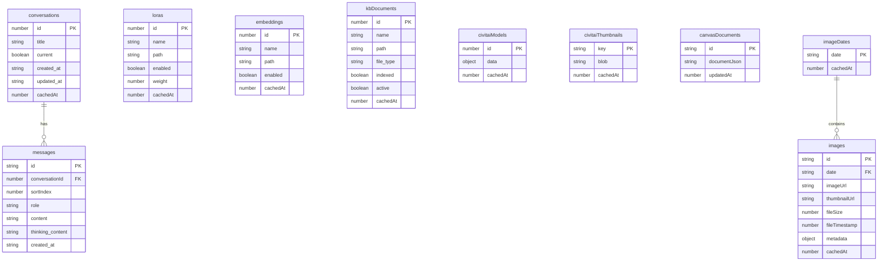

# Client Caching — Storage Reference

Complete reference for all hooks, IndexedDB tables, localStorage keys, and utilities introduced by the client-side caching layer. For architecture and data-flow diagrams, see [Client-Side Caching](Client-Side-Caching.md).

---

## IndexedDB Database

**Name:** `airunner`
**Library:** [Dexie.js](https://dexie.org/) v4
**Definition:** `client/src/db/db.ts`



### Table Details

#### `conversations`

Stores conversation metadata. Messages are stored separately to support append-only updates.

| Field | Type | Notes |
|---|---|---|
| `id` | `number` (PK) | Server-assigned |
| `title` | `string` | Auto-generated from first message |
| `current` | `boolean` | Whether server considers this the active conversation |
| `created_at` | `string` | ISO date |
| `updated_at` | `string` | ISO date — used for timestamp-wins sync |
| `cachedAt` | `number` | `Date.now()` at time of cache write |

**Indexes:** `id`, `updatedAt`, `current`, `cachedAt`

#### `messages`

Append-only. Records are never deleted by sync — only by explicit conversation deletion.

| Field | Type | Notes |
|---|---|---|
| `id` | `string` (PK) | `"${conversationId}_${sortIndex}"` |
| `conversationId` | `number` | FK to `conversations` |
| `sortIndex` | `number` | Server message order |
| `role` | `"user" \| "assistant" \| "system"` | |
| `content` | `string` | Message body |
| `thinking_content` | `string \| undefined` | Extended reasoning (if model supports it) |
| `created_at` | `string \| undefined` | ISO date |

**Indexes:** `id`, `conversationId`, `sortIndex`

#### `loras`

| Field | Type |
|---|---|
| `id` | `number` (PK) |
| `name` | `string` |
| `path` | `string` |
| `enabled` | `boolean` |
| `weight` | `number` |
| `trigger_words` | `string[]` |
| `cachedAt` | `number` |

**Indexes:** `id`, `path`, `enabled`, `cachedAt`

#### `embeddings`

| Field | Type |
|---|---|
| `id` | `number` (PK) |
| `name` | `string` |
| `path` | `string` |
| `enabled` | `boolean` |
| `trigger_words` | `string[]` |
| `cachedAt` | `number` |

**Indexes:** `id`, `path`, `enabled`, `cachedAt`

#### `kbDocuments`

| Field | Type |
|---|---|
| `id` | `number` (PK) |
| `name` | `string` |
| `path` | `string` |
| `file_type` | `string` |
| `indexed` | `boolean` |
| `active` | `boolean` |
| `cachedAt` | `number` |

**Indexes:** `id`, `active`, `indexed`, `cachedAt`

#### `civitaiModels`

| Field | Type | Notes |
|---|---|---|
| `id` | `number` (PK) | CivitAI model ID |
| `data` | `Record<string, unknown>` | Full API response blob |
| `cachedAt` | `number` | Used for 72 h TTL check |

**Indexes:** `id`, `cachedAt`

#### `civitaiThumbnails`

| Field | Type | Notes |
|---|---|---|
| `key` | `string` (PK) | `"${modelId}_${versionIndex}_${imageUrl}"` |
| `blob` | `string` | Base64 data URL |
| `cachedAt` | `number` | Used for LRU eviction |

**Indexes:** `key`, `cachedAt`

#### `canvasDocuments`

| Field | Type | Notes |
|---|---|---|
| `id` | `string` (PK) | Always `"default"` (single-document app) |
| `documentJson` | `string` | Full serialised `CanvasState` |
| `updatedAt` | `number` | `CanvasState._ts` — monotonic `Date.now()` |

**Indexes:** `id`, `updatedAt`

#### `imageDates`

| Field | Type |
|---|---|
| `date` | `string` (PK) — `"YYYY-MM-DD"` |
| `cachedAt` | `number` |

**Indexes:** `date`, `cachedAt`

#### `images`

| Field | Type | Notes |
|---|---|---|
| `id` | `string` (PK) | `"${date}__${filename}"` |
| `date` | `string` | FK to `imageDates` |
| `imageUrl` | `string` | Server URL |
| `thumbnailUrl` | `string` | Server URL |
| `fileSize` | `number` | Bytes |
| `fileTimestamp` | `number` | Unix epoch |
| `metadata` | `Record<string, unknown> \| null` | Stable diffusion generation params |
| `cachedAt` | `number` | |

**Indexes:** `id`, `date`, `cachedAt`

---

## DbContext

**File:** `client/src/db/DbContext.tsx`

```typescript
// Wrap your app (already done in main.tsx)
<DbProvider>
  <App />
</DbProvider>

// Consume in any hook or component
const db = useDb(); // AiRunnerDb | null
```

`db` is `null` when IndexedDB is unavailable (private browsing, quota pre-exhausted, or browser restriction). Every hook that uses `db` must handle this case by falling back to a direct server fetch.

---

## Domain Hooks

All hooks are in `client/src/hooks/`. None of them expose Dexie or localStorage directly — components interact only with the hook API.

---

### `useConversations()`

**File:** `client/src/hooks/useConversations.ts`

```typescript
const { conversations, loading, refresh, remove, invalidateAndRefresh } = useConversations();
```

| Return | Type | Description |
|---|---|---|
| `conversations` | `Conversation[]` | Merged list, updated live |
| `loading` | `boolean` | True until first data (cache or server) is available |
| `refresh()` | `() => Promise<void>` | Reads cache then syncs from server |
| `remove(id)` | `(id: number) => Promise<void>` | Calls `deleteConversation` + removes from IndexedDB |
| `invalidateAndRefresh()` | `() => Promise<void>` | Clears cache then does a full server fetch |

**Sync strategy:** timestamp-wins on `updatedAt`.

---

### `useConversationMessages()`

**File:** `client/src/hooks/useConversationMessages.ts`

```typescript
const { messages, setMessages, load, appendMessage, clear } = useConversationMessages();
```

| Return | Type | Description |
|---|---|---|
| `messages` | `Message[]` | Current message list |
| `setMessages` | `Dispatch<SetStateAction<Message[]>>` | Direct state setter (used for streaming) |
| `load(conversationId)` | `(id: number) => Promise<void>` | Serves cached messages instantly, then refreshes from server |
| `appendMessage(convId, msg, index)` | `Promise<void>` | Adds a message in state and IndexedDB |
| `clear()` | `() => void` | Empties the message list (new conversation) |

**Sync strategy:** append-only — server records are merged by `conversationId_index` key; nothing is ever deleted by sync.

---

### `useLoras()`

**File:** `client/src/hooks/useLoras.ts`

```typescript
const { loras, loading, sync, patchLora } = useLoras();
```

| Return | Type | Description |
|---|---|---|
| `loras` | `LoraInfo[]` | Full list (unfiltered; filtering by version is done in `LoraPanel`) |
| `loading` | `boolean` | |
| `sync()` | `() => Promise<void>` | Background sync; call in response to `EVENT_LORAS` |
| `patchLora(updated)` | `(l: LoraInfo) => Promise<void>` | Optimistic update in state + IndexedDB after a server write |

---

### `useEmbeddings()`

**File:** `client/src/hooks/useEmbeddings.ts`

```typescript
const { embeddings, loading, sync, patchEmbedding } = useEmbeddings();
```

Identical shape to `useLoras`. `sync()` responds to `EVENT_EMBEDDINGS`.

---

### `useKnowledgeBaseDocs()`

**File:** `client/src/hooks/useKnowledgeBaseDocs.ts`

```typescript
const { docs, loading, reload, toggle } = useKnowledgeBaseDocs();
```

| Return | Type | Description |
|---|---|---|
| `docs` | `DocumentRecord[]` | Full document list |
| `loading` | `boolean` | |
| `reload()` | `() => Promise<void>` | Re-syncs from server; call in response to `EVENT_DOCUMENTS` or after indexing completes |
| `toggle(docId)` | `(id: number) => Promise<void>` | Calls `toggleDocumentActive`, optimistically updates state + IndexedDB, re-syncs on error |

**Important:** both `KnowledgeBasePanel` and `ChatView` call this hook. The data is stored in a shared React subtree state (each call gets its own instance), so IndexedDB acts as the coordination layer between them — they read the same table on mount.

---

### `useCivitaiDetailCache()`

**File:** `client/src/hooks/useCivitaiDetailCache.ts`

```typescript
const { get, set } = useCivitaiDetailCache();

const cached = await get(modelId);          // JsonObject | null
await set(modelId, fetchedModelData);        // persists to IndexedDB
```

| Method | Behaviour |
|---|---|
| `get(modelId)` | Returns cached data if within 72 h TTL, otherwise `null` |
| `set(modelId, data)` | Writes to `civitaiModels`; evicts oldest entry on quota error |

---

### `useCivitaiThumbnailCache()`

**File:** `client/src/hooks/useCivitaiThumbnailCache.ts`

```typescript
const { store, getAll } = useCivitaiThumbnailCache();

await store(modelId, versionIndex, imageUrl, base64Blob);
const blobs = await getAll(modelId, versionIndex); // Record<imageUrl, base64>
```

| Method | Behaviour |
|---|---|
| `store(modelId, versionIndex, imageUrl, blob)` | Cache-miss-only: skips write if key already exists. Evicts 20 oldest on quota error. |
| `getAll(modelId, versionIndex)` | Returns all stored blobs for a version as `{ [imageUrl]: base64 }` |

---

### `useImageDates()`

**File:** `client/src/hooks/useImageDates.ts`

```typescript
const { dates, loading, reload } = useImageDates();
```

| Return | Type | Description |
|---|---|---|
| `dates` | `{ value: string; label: string }[]` | Date options for the image browser selector |
| `loading` | `boolean` | |
| `reload()` | `() => Promise<void>` | Re-fetches dates and prunes stale entries; call on `EVENT_IMAGES` |

---

### `useLocalStorage<T>(key, defaultValue)`

**File:** `client/src/hooks/useLocalStorage.ts`

```typescript
const [value, setValue] = useLocalStorage<string>("my_key", "default");
```

Typed, synchronous read on init (safe for `useState` initialiser). Serialises/deserialises via `JSON.parse` / `JSON.stringify`.

---

### Preference Hooks

These are thin wrappers around `useLocalStorage` grouping related keys.

| Hook | File | Keys managed |
|---|---|---|
| `useLayoutPrefs()` | `hooks/useLayoutPrefs.ts` | `show_chat`, `show_canvas`, `tts_on`, `stt_on`, `left_panel`, `right_panel`, `conversation_id` |
| `useArtPrefs()` | `hooks/useArtPrefs.ts` | `art_model`, `art_version`, `seed` |
| `useCivitaiPrefs()` | `hooks/useCivitaiPrefs.ts` | `civitai_base_model`, `civitai_model_type`, `civitai_selected_model`, `civitai_api_key` |
| `useLlmPrefs()` | `hooks/useLlmPrefs.ts` | `airunner:modelPath`, `temperature`, `maxTokens`, `selectedVoice`, `whisperModel`, `activeTab` |

---

## Utilities

### `SyncManager<T>` — `client/src/db/SyncManager.ts`

See the [SyncManager section in Client-Side-Caching](Client-Side-Caching.md#the-syncmanager-pattern) for the full description and sequence diagram.

```typescript
const manager = new SyncManager(db.loras, serverFetch, "loras");
const cached = await manager.readCached();
const merged = await manager.sync();
await manager.invalidate();
```

### `withQuotaEviction(action)` — `client/src/db/evict.ts`

Wraps a Dexie write and retries after progressive eviction if `QuotaExceededError` is thrown.

```typescript
import { withQuotaEviction } from "../db/evict";

await withQuotaEviction(async () => {
  await db.myTable.put(record);
});
```

### `clearAllCache()` — `client/src/db/evict.ts`

Clears all evictable tables and removes all `airunner:sync:*` localStorage timestamps. Safe to call from the debug panel or a "Reset Cache" settings action.

```typescript
import { clearAllCache } from "../db/evict";
await clearAllCache();
```

---

## File Map

```
client/src/
├── db/
│   ├── db.ts                    Dexie instance + all table/interface definitions
│   ├── SyncManager.ts           Generic cache-first sync utility
│   ├── DbContext.tsx            React context (DbProvider + useDb hook)
│   └── evict.ts                 Quota eviction + clearAllCache
├── hooks/
│   ├── useLocalStorage.ts       Typed localStorage hook
│   ├── useLayoutPrefs.ts        App layout state (showChat, panels, conversationId…)
│   ├── useArtPrefs.ts           Art model/version/seed
│   ├── useCivitaiPrefs.ts       CivitAI browser filter state
│   ├── useLlmPrefs.ts           LLM/TTS/STT settings
│   ├── useConversations.ts      Conversation list (IndexedDB + server)
│   ├── useConversationMessages.ts Message list (append-only IndexedDB)
│   ├── useLoras.ts              LoRA list (IndexedDB + server)
│   ├── useEmbeddings.ts         Embeddings list (IndexedDB + server)
│   ├── useKnowledgeBaseDocs.ts  KB document list (IndexedDB + server)
│   ├── useCivitaiDetailCache.ts CivitAI model detail (TTL-based IndexedDB)
│   ├── useCivitaiThumbnailCache.ts Thumbnail blobs (cache-miss-only IndexedDB)
│   └── useImageDates.ts         Image date list (IndexedDB + server)
└── components/shared/
    └── CacheDebugPanel.tsx      Dev-only floating cache inspector
```
