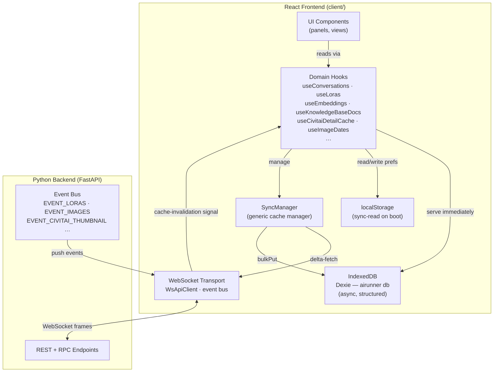
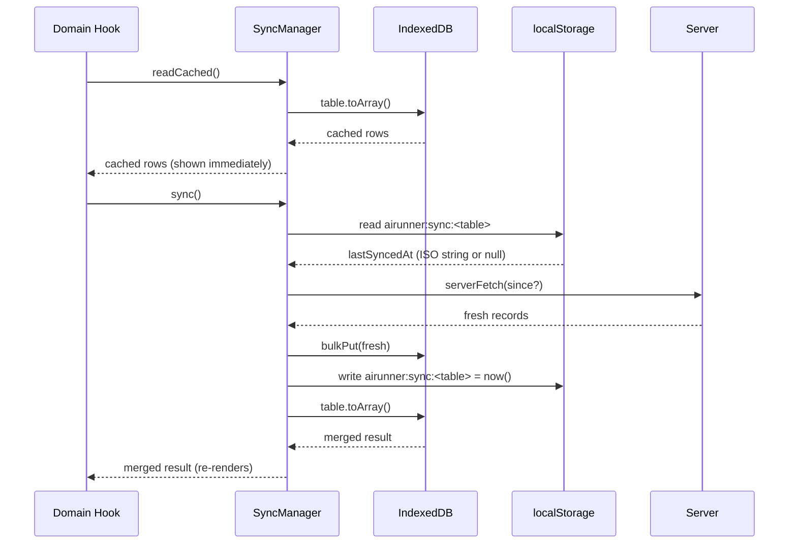
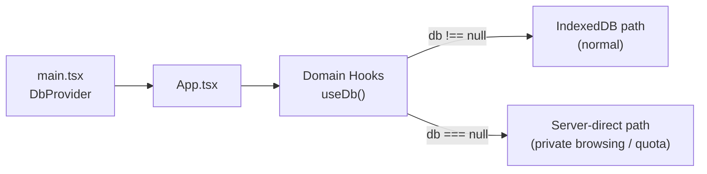
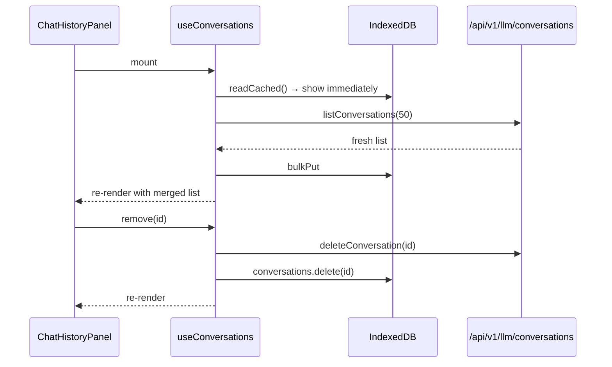
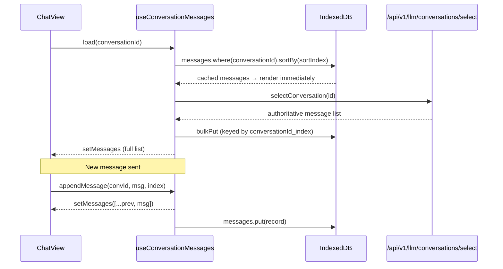
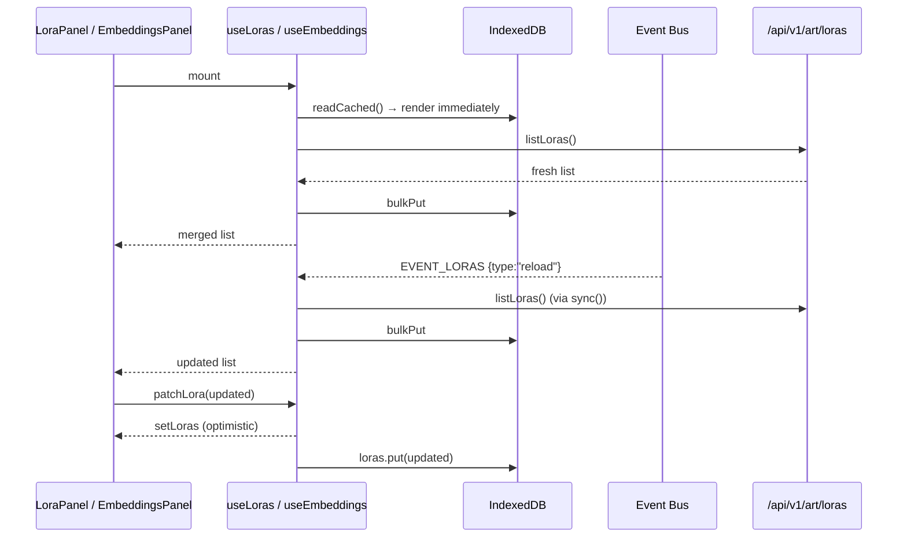
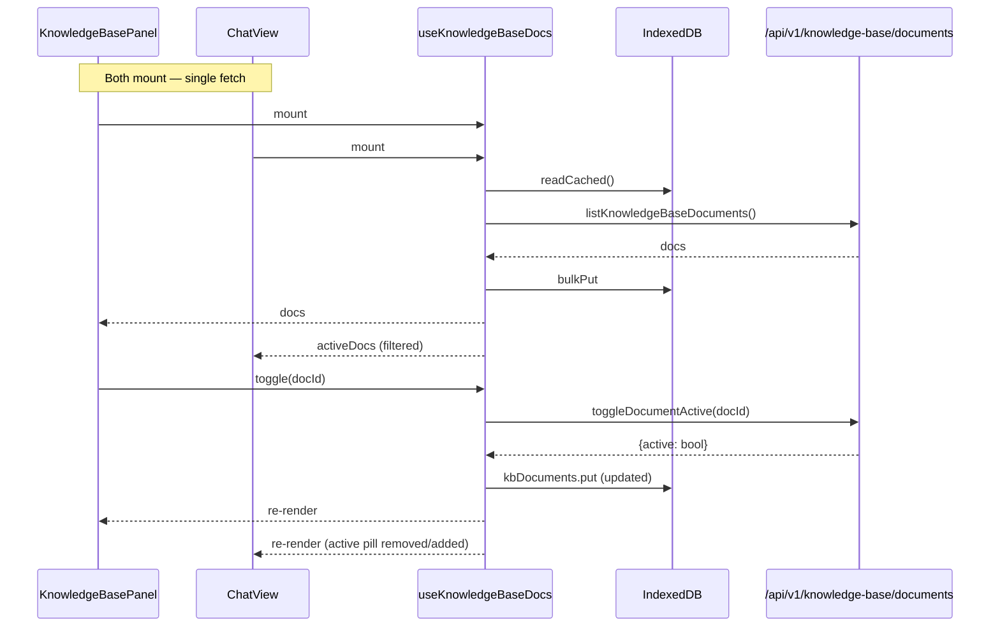
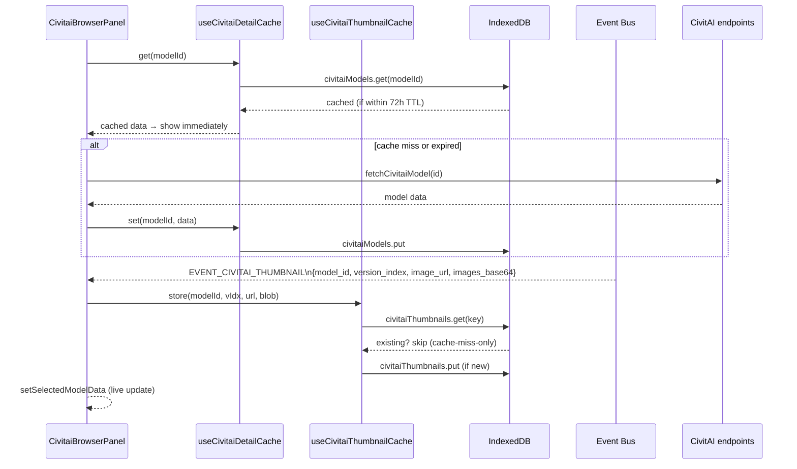
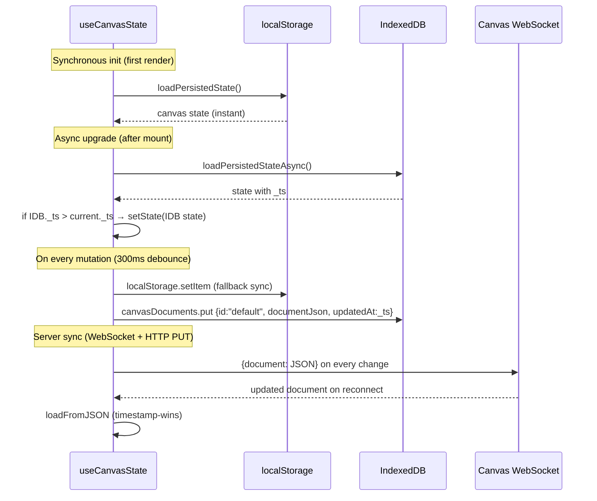
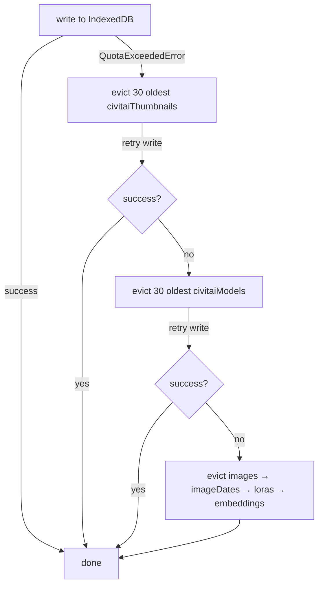

# Client-Side Caching Architecture

The React frontend implements a two-tier client-side cache using **`localStorage`** for small scalar data and **IndexedDB** (via [Dexie.js](https://dexie.org/)) for structured collections and binary assets. The design eliminates redundant server round-trips, enables instant-on rendering from cache, and keeps the app functional when the server is temporarily unreachable.

---

## Storage Tiers at a Glance

| Tier | Technology | What goes here |
|---|---|---|
| **localStorage** | `localStorage` API (synchronous) | UI preferences, auth prefs, sync timestamps, small scalars read on app boot |
| **IndexedDB** | Dexie.js (async, transactional) | Conversations, messages, LoRAs, embeddings, KB documents, CivitAI model details, thumbnails, canvas state, image dates |
| **Browser HTTP cache** | Native (no code required) | Generated image blobs served from server URLs |
| **Server only** | No local copy | Real-time model status, active download progress |

---

## Full Stack Overview



---

## The SyncManager Pattern

`SyncManager` (`client/src/db/SyncManager.ts`) is the generic cache-first fetch utility every domain hook builds on.



### Constructor

```typescript
new SyncManager<T>(
  table:       Dexie.Table<T, unknown>,
  serverFetch: (since?: string) => Promise<T[]>,
  syncKey:     string,   // stored as airunner:sync:<syncKey> in localStorage
)
```

### Methods

| Method | Behaviour |
|---|---|
| `readCached()` | Returns all rows from the Dexie table immediately |
| `sync()` | Reads `lastSyncedAt` from localStorage, calls `serverFetch`, `bulkPut`s results, updates timestamp, returns merged table |
| `invalidate()` | Clears the table and removes the localStorage timestamp; next `sync()` does a full fetch |
| `getLastSynced()` | Returns the ISO timestamp string or null |
| `setLastSynced(ts)` | Writes directly (used internally after sync) |

> **Server compatibility:** `serverFetch` receives an optional `since` ISO timestamp. Servers that support `updated_after` filtering return only changed records (delta). Servers that ignore it return all records — `bulkPut` handles the merge safely either way.

---

## DbContext and the Null Fallback

`DbProvider` (`client/src/db/DbContext.tsx`) wraps the application and provides the Dexie instance via React context.



- In normal browsers the hook returns the `AiRunnerDb` Dexie instance.
- In Firefox private mode (and any context where `indexedDB.open()` throws), the hook returns `null`. Every domain hook checks for `null` and falls back to calling the server API directly — the app remains fully functional, just without a local cache.

---

## Conflict Resolution Strategies

Different data types require different merge behaviours when the client and server disagree.

| Data Type | Strategy | Rationale |
|---|---|---|
| Conversations (metadata) | **timestamp-wins** | `updatedAt` on each record; newer side overwrites |
| Messages | **append-only** | Messages are immutable once sent; `bulkPut` keyed by index merges without deleting |
| LoRAs / Embeddings | **timestamp-wins** | Server is authoritative; user edits (toggle, weight) are sent to server before cache is updated |
| KB Documents | **server-wins on toggle** | `toggleDocumentActive` is confirmed server-side; optimistic local update rolls back on error |
| CivitAI model details | **72 h TTL then server-wins** | CivitAI data changes rarely; server caches 72 h so client matches |
| CivitAI thumbnails | **cache-miss-only** | Thumbnails are immutable; once stored they are never overwritten |
| Canvas state | **`_ts` timestamp-wins** | `_ts` (monotonic `Date.now()`) is set on every mutation; higher value wins on load |
| Image dates | **server-wins** | Full replace on sync; stale dates pruned from IndexedDB |
| Settings singletons | **server-wins on mount** | Server value hydrates local state on every `SettingsView` open |

---

## Data Flow by Feature

### Chat History



### Conversation Messages (append-only)



### LoRAs / Embeddings



### Knowledge Base Documents



### CivitAI Browser



### Canvas State



---

## localStorage Keys

All keys written by the caching layer follow the `airunner:` or `airunner_` prefix convention. Sync timestamps use `airunner:sync:<table>`.

### Sync Timestamps (written by SyncManager)

| Key | Meaning |
|---|---|
| `airunner:sync:conversations` | ISO timestamp of last conversation list sync |
| `airunner:sync:loras` | ISO timestamp of last LoRA list sync |
| `airunner:sync:embeddings` | ISO timestamp of last embeddings sync |
| `airunner:sync:kbDocuments` | ISO timestamp of last KB document sync |
| `airunner:sync:imageDates` | ISO timestamp of last image date list sync |

### Layout & UI State (written by `useLayoutPrefs`)

| Key | Type | Default |
|---|---|---|
| `airunner_show_chat` | boolean | `true` |
| `airunner_show_canvas` | boolean | `false` |
| `airunner_tts_on` | boolean | `false` |
| `airunner_stt_on` | boolean | `false` |
| `airunner_left_panel` | `PanelId \| null` | `null` |
| `airunner_right_panel` | `PanelId \| null` | `null` |
| `airunner_conversation_id` | `number \| null` | `null` |

### LLM / TTS / STT Settings (written by `useLlmPrefs`)

| Key | Type | Default |
|---|---|---|
| `airunner:modelPath` | string | `""` |
| `airunner:temperature` | number | `0.7` |
| `airunner:maxTokens` | `number \| null` | `null` |
| `airunner:selectedVoice` | string | `""` |
| `airunner:whisperModel` | string | `""` |
| `airunner:activeTab` | string | `"llm"` |

### Art & CivitAI Prefs (written by `useArtPrefs` / `useCivitaiPrefs`)

| Key | Type | Default |
|---|---|---|
| `airunner_art_model` | string | `""` |
| `airunner_art_version` | string | `""` |
| `airunner_seed` | string | `""` |
| `airunner_civitai_base_model` | string | `""` |
| `airunner_civitai_model_type` | string | `""` |
| `airunner_civitai_selected_model` | `number \| null` | `null` |
| `airunner_civitai_api_key` | string | `""` |

### Image Browser

| Key | Type |
|---|---|
| `airunner_image_browser_date` | `string \| null` |

---

## Storage Quota and Eviction

IndexedDB storage is finite. When a write throws `DOMException: QuotaExceededError`, the eviction policy in `client/src/db/evict.ts` kicks in:



**Protected tables** (never evicted): `conversations`, `messages`, `canvasDocuments`, `kbDocuments`.

### Manual Cache Clear

```typescript
import { clearAllCache } from "client/src/db/evict";

await clearAllCache();
// Clears: civitaiThumbnails, civitaiModels, images, imageDates,
//         loras, embeddings, kbDocuments
// Removes: all airunner:sync:* localStorage keys
// Preserves: conversations, messages, canvasDocuments
```

---

## Developer Cache Debug Panel

In development mode (`npm run dev`) or when `?debug` is appended to any URL, a floating overlay appears in the bottom-right corner of the app.

The panel shows:
- Row count per IndexedDB table
- Last-sync timestamp per table
- **Force Sync** — clears `airunner:sync:<table>` so the next hook mount does a full re-fetch
- **Clear All** — calls `clearAllCache()` and refreshes the display
- **Refresh** — re-reads all counts without clearing

```
┌────────────────────────────────────────── Cache Debug ──── [Refresh] [Clear All] ─┐
│ Table                │ Rows │ Last Synced          │                               │
│ conversations        │   12 │ 14:32:01             │ [Force Sync]                  │
│ messages             │  204 │ (append-only)        │                               │
│ loras                │   47 │ 14:31:58             │ [Force Sync]                  │
│ embeddings           │   23 │ 14:31:59             │ [Force Sync]                  │
│ kbDocuments          │    5 │ 14:32:00             │ [Force Sync]                  │
│ civitaiModels        │    8 │ (TTL-based)          │                               │
│ civitaiThumbnails    │  312 │ (cache-miss-only)    │                               │
│ canvasDocuments      │    1 │ (timestamp-wins)     │                               │
│ imageDates           │    7 │ 14:31:57             │ [Force Sync]                  │
│ images               │   60 │ (by date)            │                               │
└───────────────────────────────────────────────────────────────────────────────────┘
```

---

## Adding a New Cached Data Type

Follow this checklist when caching a new server resource:

1. **Add a Dexie table** in `client/src/db/db.ts`:
   - Define the interface (extend it with `cachedAt: number`)
   - Add the table declaration and `version(1).stores()` entry with appropriate indexes
   - Bump the Dexie version number if changing an existing schema

2. **Write a domain hook** in `client/src/hooks/use<Name>.ts`:
   ```typescript
   export function useMyData() {
     const db = useDb();
     const [data, setData] = useState([]);

     const serverFetch = useCallback(async () => { /* call API */ }, []);

     const sync = useCallback(async () => {
       if (!db) { /* fallback */ return; }
       const manager = new SyncManager(db.myTable, serverFetch, "myTable");
       const cached = await manager.readCached();
       if (cached.length > 0) setData(cached);
       const merged = await manager.sync();
       setData(merged);
     }, [db, serverFetch]);

     useEffect(() => { sync(); }, [sync]);
     return { data, sync };
   }
   ```

3. **Add a sync key** to the `SYNC_TABLE_MAP` in `CacheDebugPanel.tsx`.

4. **Add the table** to the eviction order in `evict.ts` if it holds large data.

5. **Update `Home.md`** if the new data type warrants its own wiki page.
